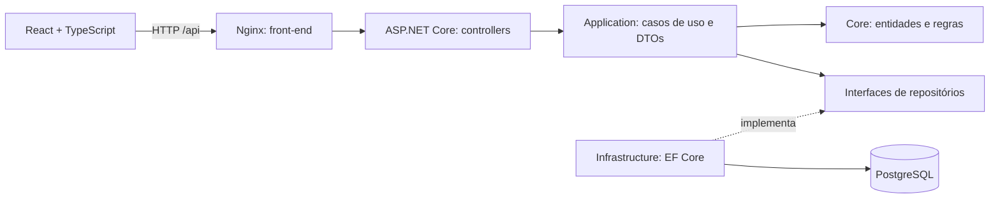

# Carrinho de Compras — API

API em C# / .NET 10, ASP.NET Core e PostgreSQL via Entity Framework Core.
Inclui CRUD de produtos e cupons, gerenciamento de carrinhos, itens, descontos e checkout.

## Camadas

- `Carrinho.API`: controllers, configuração HTTP, OpenAPI e erros em Problem Details.
- `Carrinho.Application`: casos de uso, contratos de repositórios e DTOs.
- `Carrinho.Core`: entidades e regras de domínio, sem dependências de infraestrutura.
- `Carrinho.Infrastructure`: EF Core, mapeamentos, migrations e repositórios PostgreSQL.
- `Carrinho.UnitTests`: testes das regras do domínio.

Dependências: Application → Core; Infrastructure → Application/Core; API → Application/Infrastructure.
A API referencia Infrastructure para compor a injeção de dependência. Controllers usam casos de uso.

### Arquitetura da solução completa



O back-end usa uma arquitetura em camadas com princípios de DDD: `CarrinhoCompra` é a raiz do agregado e controla itens, cupom, cálculos e finalização. Controllers recebem requisições e chamam casos de uso; não acessam diretamente o banco. A infraestrutura implementa os contratos de persistência. A composição das dependências fica em `Program.cs`.

O front-end usa componentes React como apresentação, interfaces TypeScript como modelos, hooks/controllers para coordenar estado e serviços para HTTP. A API é a fonte dos totais e das validações de estoque. O PostgreSQL usa volume persistente; `migrate` prepara o schema antes de a API iniciar.

## Abrir no Visual Studio

Abra `Carrinho.sln`, com suporte ao SDK .NET 10 instalado, e selecione `Carrinho.API` como projeto de inicialização.
No VS Code, abra a pasta raiz deste repositório.

## Executar com Docker

Requer Docker com suporte a containers Linux e Docker Compose v2.

```powershell
if (-not (Test-Path .env)) { Copy-Item .env.example .env }
# Edite a senha em .env antes de continuar.
docker compose up --build -d
```

O serviço `migrate` aplica as migrations e termina antes da API iniciar.
A API fica em `http://localhost:8080`; o PostgreSQL possui volume persistente.
Portas publicadas ficam restritas ao localhost. `docker compose down` mantém os dados;
não use `down -v` se precisar preservá-los.

### Rodar API, banco e front-end juntos

Abra o Docker Desktop e aguarde o engine Linux iniciar. Mantenha os repositórios em pastas irmãs chamadas `back-end` e `front-end`. Se ainda não baixou os projetos:

```powershell
git clone --branch developer https://github.com/matheusmoreirap852/Teste-T-cnico-Carrinho-de-Compras-Back-end.git back-end
git clone https://github.com/matheusmoreirap852/Teste-T-cnico-Carrinho-de-Compras-Front.git front-end
cd back-end
if (-not (Test-Path .env)) { Copy-Item .env.example .env }
# Configure POSTGRES_PASSWORD no .env antes da primeira inicialização.
docker compose -f compose.yaml -f compose.frontend.yaml up --build -d
docker compose run --rm migrate --seed-demo
```

Se os projetos já estão baixados, execute os dois últimos comandos na pasta `back-end`. O segundo é opcional e insere os dados fictícios de demonstração.

### Dados de demonstração

O arquivo `src/Carrinho.API/Data/demo-produtos.json` contém **10 produtos fictícios**, identificados pelos IDs 9001 a 9010. Esses dados não substituem `produtos.json` e `cupons.json` oficiais do desafio, ainda não fornecidos.

```powershell
# Com o banco iniciado e a imagem atualizada:
docker compose run --rm migrate --seed-demo

# Alternativa local, com connection string configurada por user-secrets:
dotnet run --project src/Carrinho.API -- --seed-demo
```

O comando aplica migrations pendentes e insere somente IDs ausentes em uma transação. Pode ser repetido: não duplica registros, não sobrescreve preços e não repõe estoque consumido. Se um ID já existir, ele é preservado mesmo que seus dados sejam diferentes. O seed não roda automaticamente ao iniciar a API.

| ID | Produto | Preço inicial | Estoque inicial |
|---|---|---:|---:|
| 9001 | Café especial 250 g | R$ 19,90 | 20 |
| 9002 | Caneca de cerâmica | R$ 39,90 | 12 |
| 9003 | Garrafa térmica 500 ml | R$ 79,90 | 8 |
| 9004 | Caderno pontilhado | R$ 24,50 | 15 |
| 9005 | Kit de canetas coloridas | R$ 14,90 | 30 |
| 9006 | Fone de ouvido sem fio | R$ 149,90 | 6 |
| 9007 | Luminária de mesa | R$ 89,90 | 4 |
| 9008 | Ecobag de algodão | R$ 29,90 | 10 |
| 9009 | Organizador de mesa | R$ 49,90 | 0 |
| 9010 | Mouse sem fio | R$ 59,90 | 1 |

Os cupons `10OFF` e `15OFF` são criados pelas migrations. O seed não recria cupons removidos nem altera os que já foram editados.

### Roteiro para testar pela loja

1. Abra http://localhost:3000 e clique em **Atualizar** se a página já estava aberta.
2. Adicione dois cafés (9001) e uma caneca (9002): subtotal **R$ 79,70**.
3. Aplique `10OFF`: desconto **R$ 7,97**, total **R$ 71,73**.
4. Troque por `15OFF`: desconto **R$ 11,96**, total **R$ 67,74**.
5. Remova o cupom e altere as quantidades para conferir o recálculo.
6. O organizador (9009) aparece sem estoque; o mouse (9010) permite apenas uma unidade.
7. Finalize e confira o bloqueio do carrinho e a baixa de estoque. Use **Começar nova compra** para repetir.

Os valores esperados pressupõem o catálogo inicial e cupons sem alterações. Para repor um estoque durante seus testes, use o PUT de produtos no Swagger; repetir o seed preserva o estoque atual.

| Serviço | Endereço |
|---|---|
| Loja | http://localhost:3000 |
| Swagger | http://localhost:8080/swagger |
| API | http://localhost:8080/api/produtos |
| Saúde e acesso ao banco | http://localhost:8080/health/ready |
| PostgreSQL | localhost:5432 |

O front-end é compilado no Docker e servido pelo Nginx. Requisições `/api` são encaminhadas internamente para `api:8080`, sem precisar de CORS ou configurar uma URL no código do navegador. Você não precisa instalar Node ou .NET para usar o conjunto no Docker.

### Comandos do dia a dia

```powershell
# Estado dos serviços (migrate com Exited 0 é normal)
docker compose -f compose.yaml -f compose.frontend.yaml ps -a

# Logs
docker compose -f compose.yaml -f compose.frontend.yaml logs -f api web

# Atualizar após modificar o código
docker compose -f compose.yaml -f compose.frontend.yaml up --build -d

# Parar mantendo banco e containers
docker compose -f compose.yaml -f compose.frontend.yaml stop

# Remover containers mantendo o volume do banco
docker compose -f compose.yaml -f compose.frontend.yaml down
```

### Problemas comuns

- **Cannot connect / pipe dockerDesktopLinuxEngine:** abra o Docker Desktop e selecione containers Linux.
- **POSTGRES_PASSWORD ausente:** crie `.env` a partir de `.env.example` e configure a senha.
- **Porta ocupada:** altere apenas a porta à esquerda no Compose (ex.: `127.0.0.1:3001:80` para o front-end).
- **Erro de login no banco após mudar a senha:** o volume existente mantém a senha de criação. Volte à senha original ou altere o usuário no PostgreSQL; editar `.env` não muda o banco já inicializado.
- **502 no front-end:** confira `docker compose ps -a` e os logs de `api` e `migrate`. A migration deve terminar com código 0.

Para EC2, esta configuração ainda precisa de domínio/HTTPS, regras de rede e gestão de segredos. As portas atuais estão vinculadas a localhost para execução local.

## Executar pelo Visual Studio ou terminal

```powershell
docker compose up -d db
dotnet user-secrets set "ConnectionStrings:Carrinho" "Host=localhost;Port=5432;Database=carrinho;Username=carrinho;Password=SUA_SENHA" --project src/Carrinho.API
dotnet restore
dotnet run --project src/Carrinho.API -- --migrate
dotnet run --project src/Carrinho.API --launch-profile http
```

Use a mesma senha, usuário e banco configurados no `.env`. Senhas não são versionadas.
No perfil `http`, a API fica em `http://localhost:5269`.

## Endpoints

| Método | Rota | Objetivo |
|---|---|---|
| GET | `/api/produtos` | Lista produtos persistidos, com preço e estoque |
| POST | `/api/produtos` | Cadastra produto com ID informado |
| GET / PUT / DELETE | `/api/produtos/{id}` | Consulta, atualiza ou exclui produto |
| GET / POST | `/api/cupons` | Lista ou cadastra cupons |
| GET / PUT / DELETE | `/api/cupons/{id}` | Consulta, atualiza ou exclui cupom |
| POST | `/api/carrinhos` | Cria carrinho aberto com UUID |
| GET | `/api/carrinhos?pagina=1&tamanho=20` | Lista carrinhos, até 100 por página |
| GET / DELETE | `/api/carrinhos/{id}` | Consulta ou exclui carrinho aberto |
| POST | `/api/carrinhos/{id}/itens` | Adiciona produto ou soma quantidade |
| PUT | `/api/carrinhos/{id}/itens/{produtoId}` | Substitui a quantidade do item |
| DELETE | `/api/carrinhos/{id}/itens/{produtoId}` | Remove o item |
| PUT / DELETE | `/api/carrinhos/{id}/cupom` | Aplica/troca ou remove cupom |
| POST | `/api/carrinhos/{id}/checkout` | Finaliza e baixa o estoque |
| GET | `/health/live` | Verifica se o processo responde |
| GET | `/health/ready` | Verifica acesso à tabela Produto; retorna 503 se indisponível |
| GET | `/openapi/v1.json` | Documento OpenAPI, somente em Development |
| GET | `/swagger` | Interface interativa Swagger UI, somente em Development |

Exemplos no arquivo `src/Carrinho.API/Carrinho.API.http`.
Swagger UI está disponível em `http://localhost:8080/swagger` pelo Docker ou `http://localhost:5269/swagger` pelo perfil HTTP. Use **Try it out** e **Execute** para consultar os endpoints. A interface utiliza o documento `/openapi/v1.json`.
O catálogo começa vazio se o seed opcional não for executado. Você também pode cadastrar produtos pelo Swagger ou pela loja.

## Regras e decisões

- A primeira inclusão cria o item com quantidade **1**, conforme o enunciado. Inclusões seguintes somam a quantidade enviada. A quantidade enviada também precisa ser positiva e não exceder o estoque.
- `PUT` no item substitui a quantidade. Produtos sem estoque não podem ser adicionados.
- Um único cupom pode estar aplicado; aplicar outro substitui o anterior. Códigos são normalizados para maiúsculas.
- Os cupons `10OFF` e `15OFF` são cadastrados pela migration com IDs provisórios 1 e 2, usando os percentuais do PDF. Os IDs devem ser conferidos com `cupons.json` quando fornecido.
- Preço e descrição do item são preservados no momento da primeira inclusão. O percentual e código do cupom são preservados no momento da aplicação. Edições posteriores no catálogo não mudam os valores de carrinhos existentes; reaplicar um cupom usa os dados atuais.
- Totais são derivados dos itens persistidos e do percentual aplicado, evitando colunas redundantes. Desconto é arredondado para duas casas decimais, com ponto médio afastado de zero.
- Estoque não é reservado ao adicionar. No checkout, todas as quantidades são revalidadas e o estoque é baixado na mesma transação que finaliza o carrinho.
- Concorrência otimista usa `xmin` no PostgreSQL para produtos/cupons e uma versão no agregado Carrinho. Operações conflitantes retornam 409; consulte novamente antes de tentar de novo. A transação impede baixa parcial e venda duplicada da última unidade.
- Carrinho vazio não pode ser finalizado. Carrinho finalizado não aceita alterações, exclusão ou novo checkout.
- Produtos e cupons vinculados a carrinhos não podem ser excluídos. A restrição preserva a integridade e o histórico.
- Erros usam Problem Details: 400 para corpo inválido, 404 para recurso inexistente, 409 para conflito e 422 para regra de negócio. Criação retorna 201 e exclusão de cadastro/carrinho retorna 204.

O carrinho é atualizado por operações específicas de itens e cupom; não há um PUT genérico que permita sobrescrever totais ou status.

## Testes e migrations

```powershell
dotnet test Carrinho.sln
dotnet test Carrinho.sln --collect:"XPlat Code Coverage" --logger "trx;LogFileName=unitarios.trx" --results-directory TestResults
dotnet tool restore
dotnet ef migrations add NomeDaMigration --project src/Carrinho.Infrastructure --startup-project src/Carrinho.API --output-dir Persistence/Migrations
```

Para criar migrations, configure a connection string por user-secrets conforme acima.
Valores monetários usam `decimal` e a coluna de preço usa `numeric(18,2)`.

Os testes unitários usam dados fictícios e um repositório simulado, sem conectar ao banco ou precisar do Docker. No Visual Studio, abra **Teste > Gerenciador de Testes > Executar Todos**. Consulte `tests/Carrinho.UnitTests/README.md` para os cenários e limites da validação.

### Integração com PostgreSQL isolado

Requer Python 3 e imagens construídas pelo Compose principal. Execute a partir da raiz:

```powershell
docker compose build
docker compose -p carrinho-tests -f compose.integration.yaml up -d
# Aguarde http://localhost:18080/health/ready responder 200.
python tests/integration.py
docker compose -p carrinho-tests -f compose.integration.yaml down -v
```

O ambiente de teste tem banco próprio e API na porta 18080; não usa o volume de desenvolvimento. O script cria dados temporários e verifica CRUD, cálculos, erros, bloqueio após checkout e disputa concorrente pela última unidade. O último comando remove somente os containers e volumes desse ambiente de teste.

## Próximas etapas

- Importar `produtos.json` e `cupons.json` originais, ainda não fornecidos. O catálogo de demonstração é explicitamente fictício.
- Implementar autenticação. Os endpoints atuais ainda não exigem credenciais.
- Evoluir o front-end integrado: catálogo, carrinho, cupom e checkout já estão disponíveis via Nginx, sem necessidade de CORS na execução conjunta.
- Preparar a implantação EC2 com Nginx, HTTPS, ambiente Production, segredos e backups.

O Compose atual é para desenvolvimento e verificação local; não representa uma implantação EC2 concluída.
O front-end será mantido no repositório separado informado pelo usuário.

## Validação desta etapa

- 89 testes unitários aprovados, sem falhas ou testes ignorados. Cobertura de linhas: Core 97,76% e Application 98,43%; cobertura de ramificações: 100% em ambas as camadas. Esses percentuais não incluem API ou Infrastructure.
- 59 verificações HTTP aprovadas com PostgreSQL isolado, incluindo checkout concorrente.
- API iniciada localmente: saúde e OpenAPI responderam 200.
- Sem banco disponível: readiness respondeu 503 e catálogo respondeu 500 em Problem Details, sem expor detalhes internos.
- Sintaxe do Compose validada e migration inicial gerada.
- Containers compilados e iniciados com Docker Compose; PostgreSQL saudável e migration inicial aplicada com sucesso (serviço migrate encerrado com código 0).
- Com banco real, `/health/live`, `/health/ready`, `/api/produtos` e `/openapi/v1.json` responderam 200 em `http://localhost:8080`.
- Catálogo de demonstração disponível via comando explícito `--seed-demo`, separado dos dados oficiais.
